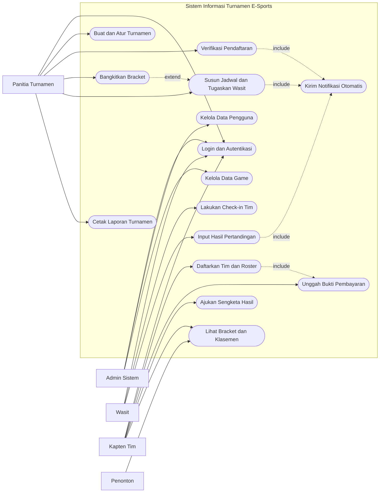
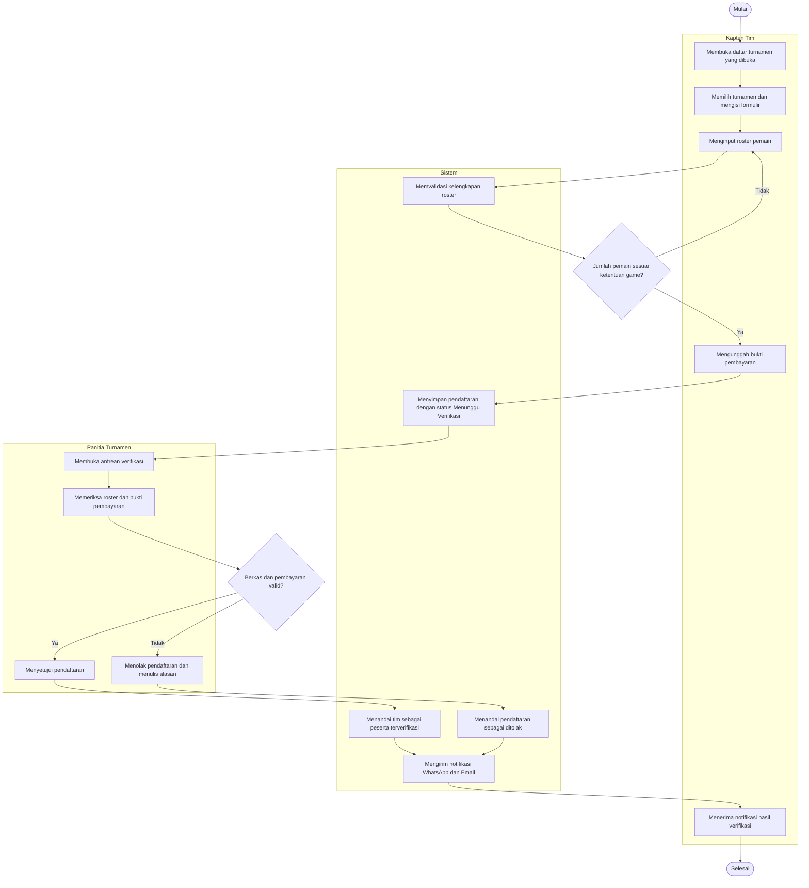
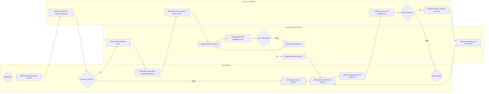
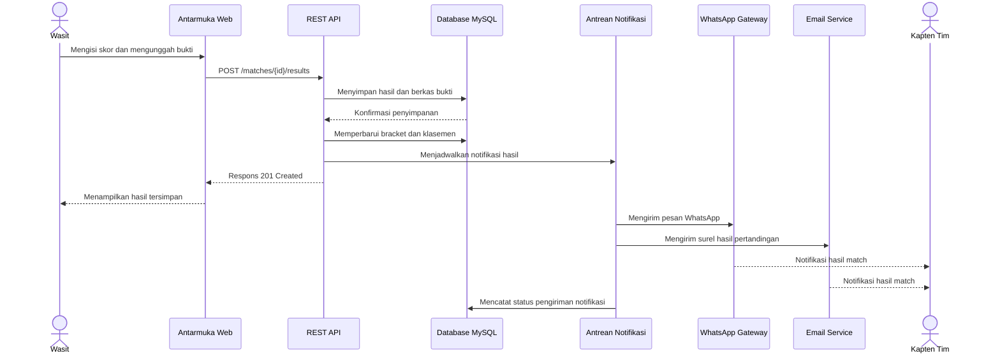
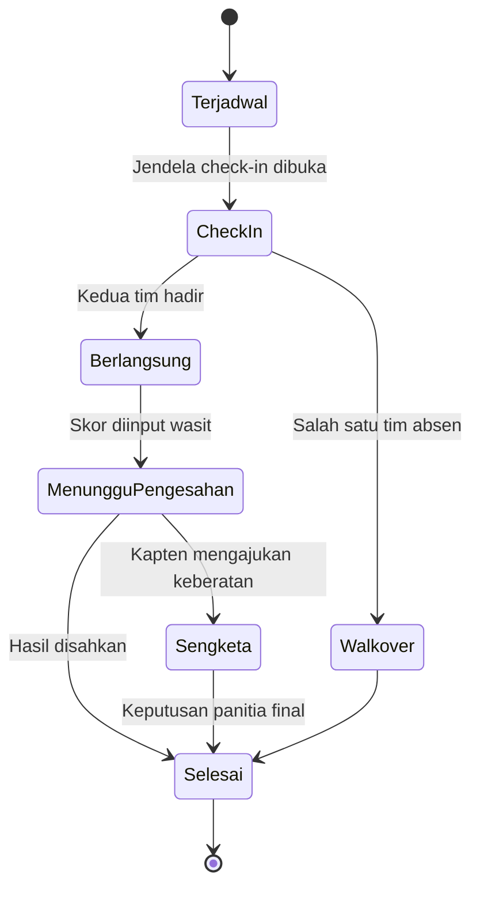
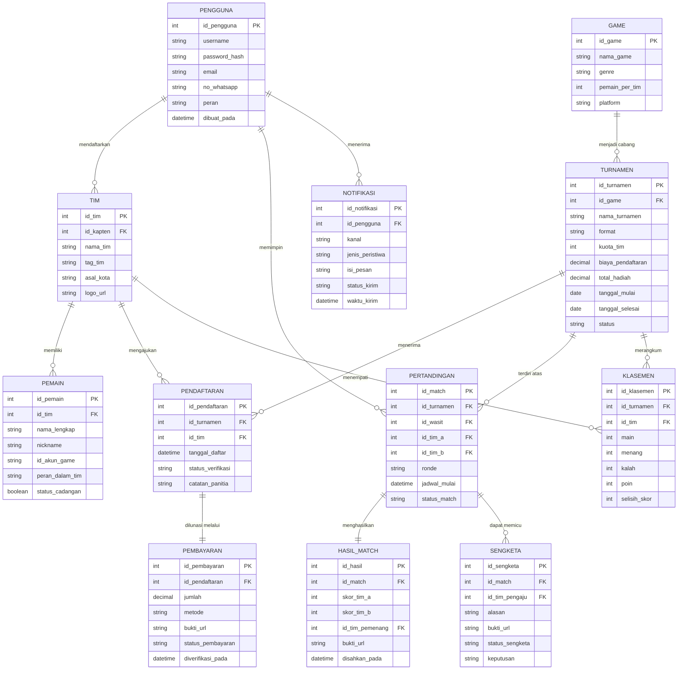

# Sistem Informasi Turnamen E-Sports

## Deskripsi Proyek

Sistem Informasi Turnamen E-Sports merupakan sistem informasi berbasis web yang dirancang untuk membantu penyelenggara turnamen dalam mengelola seluruh siklus kompetisi, mulai dari pendaftaran tim, verifikasi pembayaran, penyusunan bracket, penjadwalan pertandingan, pencatatan hasil, hingga publikasi klasemen dan laporan akhir turnamen.

Sistem ini bertujuan menggantikan pengelolaan turnamen yang selama ini banyak dilakukan melalui Google Form, grup WhatsApp, dan spreadsheet terpisah. Pola tersebut rentan terhadap data ganda, jadwal bentrok, keterlambatan informasi kepada peserta, serta sengketa hasil pertandingan karena bukti skor tersebar di banyak tempat.

Dengan memanfaatkan teknologi web dan layanan notifikasi WhatsApp maupun Email, sistem memungkinkan panitia mengelola turnamen secara terpusat, wasit menginput hasil pertandingan secara real-time, kapten tim memantau jadwal dan bracket, serta penonton mengakses klasemen publik tanpa perlu login.

---

## Tujuan Proyek

* Mendigitalisasi proses pendaftaran dan verifikasi peserta turnamen.
* Menghilangkan bentrok jadwal melalui penyusunan bracket dan slot pertandingan otomatis.
* Memberikan notifikasi otomatis kepada tim mengenai jadwal, perubahan jadwal, dan hasil pertandingan.
* Menyediakan dashboard bracket dan klasemen secara real-time.
* Menyimpan bukti hasil pertandingan sebagai dasar penyelesaian sengketa.
* Menghasilkan laporan turnamen dalam format PDF dan Excel.

---

## Latar Belakang

Penyelenggaraan turnamen e-sports tingkat komunitas, kampus, maupun regional umumnya masih dikelola secara manual dan terpisah-pisah. Kondisi tersebut menimbulkan berbagai permasalahan, antara lain:

* Data pendaftaran tim tersebar antara formulir daring, chat pribadi, dan spreadsheet panitia.
* Verifikasi pembayaran memakan waktu karena bukti transfer dikirim melalui pesan pribadi.
* Bracket dan jadwal disusun manual sehingga sering terjadi bentrok slot dan salah lawan.
* Informasi perubahan jadwal terlambat sampai ke tim, yang berujung pada walkover.
* Sengketa hasil pertandingan sulit diselesaikan karena bukti skor tidak terarsip rapi.
* Rekapitulasi hadiah dan laporan sponsor memerlukan waktu lama pada akhir turnamen.

Untuk mengatasi permasalahan tersebut, diperlukan sistem informasi yang mampu mengelola seluruh data turnamen secara digital, terpusat, dan terintegrasi dengan kanal notifikasi.

---

## Kebutuhan Sistem

### Kebutuhan Fungsional

1. Sistem harus dapat mencatat pendaftaran tim beserta roster pemain secara digital.
2. Sistem harus dapat memverifikasi bukti pembayaran biaya pendaftaran.
3. Sistem harus dapat membangkitkan bracket secara otomatis berdasarkan format turnamen.
4. Sistem harus dapat menyusun jadwal pertandingan tanpa bentrok slot dan wasit.
5. Sistem harus dapat menerima input skor beserta unggahan bukti tangkapan layar.
6. Sistem harus dapat mengirim notifikasi otomatis melalui WhatsApp dan Email.
7. Sistem harus dapat menampilkan bracket dan klasemen secara real-time.
8. Sistem harus dapat menghasilkan laporan turnamen dalam format PDF dan Excel.

### Kebutuhan Non-Fungsional

| Kategori     | Kebutuhan                                                              |
| ------------ | ---------------------------------------------------------------------- |
| Kinerja      | Halaman bracket termuat di bawah 3 detik untuk 128 tim                 |
| Ketersediaan | Uptime minimal 99% selama periode turnamen berlangsung                 |
| Keamanan     | Kata sandi tersimpan dalam bentuk hash dan akses dibatasi per peran    |
| Auditabilitas| Setiap perubahan skor tercatat dalam log beserta identitas pengubahnya |
| Kompatibilitas| Antarmuka responsif pada perangkat desktop dan mobile                 |

---

## Fitur Utama

### Manajemen Pengguna

* Login dan autentikasi pengguna.
* Pengelolaan hak akses berdasarkan peran pengguna.
* Manajemen profil tim dan roster pemain.

### Pendaftaran Turnamen

* Pembuatan turnamen beserta format dan kuota peserta.
* Pendaftaran tim dan pengisian roster pemain.
* Unggah bukti pembayaran biaya pendaftaran.
* Verifikasi dan penolakan pendaftaran oleh panitia.

Status pendaftaran:

* Menunggu Verifikasi
* Terverifikasi
* Ditolak
* Dibatalkan

### Bracket dan Penjadwalan

* Pembangkitan bracket otomatis dengan format Single Elimination, Double Elimination, atau Round Robin.
* Penentuan seeding peserta.
* Penjadwalan slot pertandingan dan penugasan wasit.
* Deteksi bentrok jadwal.

### Pertandingan dan Hasil

* Check-in tim sebelum pertandingan dimulai.
* Input skor per game dan per match oleh wasit.
* Unggah bukti tangkapan layar hasil pertandingan.
* Penetapan walkover apabila tim tidak melakukan check-in.
* Pengajuan sengketa hasil oleh kapten tim.

### Notifikasi Otomatis

* Notifikasi WhatsApp.
* Notifikasi Email.
* Pemicu otomatis pada verifikasi pendaftaran, publikasi jadwal, pengingat 30 menit sebelum bertanding, dan pengesahan hasil.

### Dashboard Monitoring

* Visualisasi bracket turnamen.
* Klasemen dan statistik tim.
* Monitoring status pertandingan secara real-time.

### Pelaporan

* Rekap peserta dan pembayaran.
* Rekap hasil seluruh pertandingan.
* Filter berdasarkan turnamen, game, dan ronde.
* Export ke PDF.
* Export ke Excel.

---

## Aktor Sistem

| Aktor            | Tugas                                                                     |
| ---------------- | ------------------------------------------------------------------------- |
| Admin Sistem     | Mengelola data pengguna, data game, dan konfigurasi sistem                |
| Panitia Turnamen | Membuat turnamen, memverifikasi pendaftaran, menyusun bracket dan jadwal  |
| Wasit            | Melakukan check-in tim, menginput skor, dan mengunggah bukti pertandingan |
| Kapten Tim       | Mendaftarkan tim, mengelola roster, dan mengajukan sengketa hasil         |
| Penonton         | Melihat bracket, jadwal, dan klasemen publik tanpa autentikasi            |

---

## Ruang Lingkup Sistem

### In Scope

* Login dan autentikasi pengguna.
* Pendaftaran tim dan manajemen roster pemain.
* Verifikasi pembayaran secara manual oleh panitia.
* Pembangkitan bracket dan penjadwalan pertandingan.
* Input hasil pertandingan beserta bukti tangkapan layar.
* Notifikasi WhatsApp dan Email.
* Dashboard bracket dan klasemen publik.
* Laporan turnamen PDF dan Excel.

### Out of Scope

* Integrasi payment gateway otomatis.
* Integrasi API resmi publisher game untuk pengambilan skor otomatis.
* Sistem anti-cheat dan deteksi kecurangan dalam permainan.
* Live streaming dan penyematan skor pada overlay siaran.
* Aplikasi mobile Android dan iOS.
* Marketplace jual beli akun atau item dalam game.

---

## Teknologi yang Digunakan

### Frontend

* HTML
* CSS
* JavaScript

### Backend

* REST API
* Web Server
* Job Scheduler untuk pengingat jadwal

### Database

* MySQL

### Notifikasi

* WhatsApp Gateway
* Email Service

---

## Arsitektur Sistem

Sistem dirancang dengan arsitektur berlapis yang memisahkan tanggung jawab tiap komponen agar mudah dikembangkan dan dipelihara.

| Lapisan          | Komponen                                              |
| ---------------- | ---------------------------------------------------- |
| Tier 1: Client   | Web Peserta, Panel Wasit, Dashboard Panitia          |
| Tier 2: Integrasi| WhatsApp Gateway, Email Service, Job Scheduler        |
| Tier 3: Aplikasi | Auth, Pendaftaran, Bracket, Pertandingan, Notifikasi |
| Tier 4: Data     | MySQL: Data Master dan Transaksi Turnamen            |

Permintaan mengalir dari lapisan Client menuju lapisan Data, dan setiap lapisan hanya berkomunikasi dengan lapisan tepat di bawahnya.

---

# Diagram Sistem

Seluruh diagram di bawah ini ditulis menggunakan sintaks Mermaid sehingga dapat langsung dirender oleh GitHub, GitLab, VS Code dengan ekstensi Mermaid, maupun editor daring seperti mermaid.live.

## Use Case Diagram

---

## Activity Diagram

Diagram berikut menggambarkan alur pendaftaran tim sampai penetapan status peserta.

---

## BPMN

Diagram berikut menggambarkan proses bisnis pelaksanaan pertandingan pada hari turnamen, disusun dalam bentuk pool dan lane.

---

## Sequence Diagram

Diagram berikut menggambarkan interaksi objek saat wasit mengesahkan hasil pertandingan dan sistem mengirim notifikasi.

---

## State Diagram Status Pertandingan

---

## ERD

---

## Struktur Aktor dan Hak Akses

| Role       | Hak Akses                                                          |
| ---------- | ------------------------------------------------------------------ |
| Admin      | Mengelola seluruh data sistem, pengguna, dan master data game      |
| Panitia    | Mengelola turnamen, verifikasi peserta, bracket, jadwal, laporan   |
| Wasit      | Check-in tim, input skor, dan unggah bukti pada match yang diampu  |
| Kapten Tim | Mengelola tim dan roster, mendaftar turnamen, mengajukan sengketa  |
| Penonton   | Membaca bracket, jadwal, dan klasemen publik                       |

---

## Manfaat Sistem

### Manfaat Kuantitatif

* Memangkas waktu verifikasi pendaftaran dari hitungan hari menjadi hitungan menit.
* Mengurangi jumlah pertandingan yang tertunda akibat informasi jadwal yang terlambat.
* Menurunkan angka walkover melalui pengingat otomatis sebelum pertandingan.
* Mempersingkat waktu penyusunan laporan akhir turnamen.

### Manfaat Kualitatif

* Meningkatkan kredibilitas penyelenggara di mata peserta dan sponsor.
* Mempermudah penyelesaian sengketa karena bukti hasil terarsip secara terpusat.
* Meningkatkan pengalaman peserta melalui informasi jadwal yang konsisten.
* Mendukung profesionalisasi ekosistem e-sports tingkat komunitas dan kampus.

---

## Indikator Kinerja Kunci (KPI)

Keberhasilan sistem diukur melalui indikator berikut. Angka pada kolom target merupakan sasaran awal dan dapat disesuaikan dengan skala turnamen yang diselenggarakan.

| Indikator                        | Target      |
| -------------------------------- | ----------- |
| Waktu verifikasi peserta         | ≤ 15 menit  |
| Jadwal tumpang tindih (bentrok)  | 0           |
| Penyelesaian sengketa            | ≤ 24 jam    |
| Kepuasan peserta                 | ≥ 4,3 / 5   |
| Uptime sistem                    | ≥ 99%       |

Seluruh metrik diukur secara otomatis dan direfleksikan pada dashboard operasional panitia.

---

## Tim Pengembang

| Posisi                 | Jumlah |
| ---------------------- | ------ |
| Project Manager        | 1      |
| System Analyst         | 1      |
| Backend Developer      | 2      |
| Frontend Developer     | 2      |
| UI/UX Designer         | 1      |
| Database Administrator | 1      |
| QA Engineer            | 1      |

---

## Peta Jalan Pengembangan Berbasis Prioritas

Pengembangan dibagi menjadi tiga fase berdasarkan prioritas kebutuhan, mengikuti pendekatan pengembangan bertahap (XP/RAD).

### Fase 1: Minimum Viable Product (Prioritas Tinggi)

Fokus pada kebutuhan operasional dasar:

* Registrasi dan login.
* Pendaftaran tim beserta roster.
* Verifikasi pembayaran manual.
* Bracket single-elimination.
* Input skor dan bukti pertandingan.

### Fase 2: Ekspansi Fitur (Prioritas Menengah)

Fokus pada retensi dan kenyamanan transaksi:

* Format double-elimination dan round robin.
* Notifikasi WhatsApp dan Email.
* Dashboard bracket publik.
* Klasemen real-time.

### Fase 3: Skalabilitas Bisnis (Prioritas Rendah)

Fokus pada loyalitas dan analitik mendalam:

* Statistik dan analitik lanjutan.
* Modul sengketa penuh.
* Laporan sponsor otomatis.
* Manajemen multi-turnamen.

---

## Estimasi Waktu Pengembangan

| Tahap                       | Durasi   |
| --------------------------- | -------- |
| Analisis dan Perencanaan    | 2 Minggu |
| Desain UI/UX                | 2 Minggu |
| Pengembangan Database       | 1 Minggu |
| Pengembangan Backend        | 5 Minggu |
| Pengembangan Frontend       | 3 Minggu |
| Integrasi Notifikasi        | 1 Minggu |
| Pengujian                   | 2 Minggu |
| Deployment                  | 1 Minggu |
| Monitoring dan Perbaikan    | 1 Minggu |

**Total Durasi Proyek: 18 Minggu (4,5 Bulan)**

---

## Matriks Keterlacakan Kebutuhan

Matriks berikut menautkan kebutuhan bisnis (BRD), fitur produk (PRD), dan fungsi sistem (SRD) sehingga setiap fungsi teknis dapat ditelusuri kembali ke tujuan bisnisnya.

| Visi Bisnis (BRD)          | Fitur Produk (PRD)         | Fungsi Sistem (SRD)               |
| -------------------------- | -------------------------- | --------------------------------- |
| BR-03: Pendaftaran Peserta | Pendaftaran Tim + Roster   | SR-F03: Validasi dan simpan roster|
| BR-04: Penyusunan Bracket  | Generator Bracket Otomatis | SR-F04: Seeding dan anti-bentrok  |
| BR-05: Pencatatan Hasil    | Input Skor + Bukti         | SR-F05: Simpan skor dan berkas    |
| BR-06: Transparansi Info   | Bracket dan Klasemen Publik| SR-F06: Publikasi real-time       |
| BR-09: Laporan Turnamen    | Ekspor PDF dan Excel       | SR-F08: Ekstraksi data turnamen   |

Kode BR dan SR-F pada tabel bersifat contoh penomoran dan dapat disesuaikan dengan dokumen kebutuhan resmi proyek.

---

## Kesimpulan

Sistem Informasi Turnamen E-Sports merupakan solusi digital yang dirancang untuk meningkatkan efektivitas dan kredibilitas penyelenggaraan kompetisi e-sports. Melalui fitur pendaftaran daring, verifikasi pembayaran, pembangkitan bracket otomatis, notifikasi terjadwal, serta pengarsipan bukti hasil pertandingan, sistem ini mampu menekan risiko sengketa, mempercepat proses administrasi, dan memberikan pengalaman berkompetisi yang lebih tertib bagi seluruh peserta.
